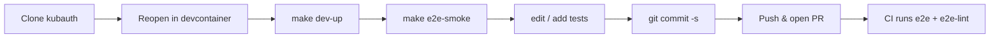

# Contributing to E2E Tests

This document covers the e2e suite under `tests/`. For Go contributions to
kubauth itself, see the root `README.md`.

## Workflow



Everything lives **inside the devcontainer**. No host install required beyond Docker.

## Prerequisites (host side)

| Tool | Why | Install |
|------|-----|---------|
| Docker | runs the devcontainer + Kind | [Docker Desktop](https://www.docker.com/products/docker-desktop/) · [Rancher Desktop](https://rancherdesktop.io) · [OrbStack](https://orbstack.dev) (macOS) |
| VS Code | edits + "Reopen in Container" | <https://code.visualstudio.com> |
| VS Code Dev Containers extension | spawns the container | `ms-vscode-remote.remote-containers` |

That's it. Everything else (kubectl, kind, helm, chainsaw, shellcheck, …) is pinned in `mise.toml` and installed by the devcontainer.

## First-time setup

1. **Clone the kubauth repo**:

   ```sh
   gh repo clone kubauth/kubauth
   ```

2. **Open in VS Code**:

   ```sh
   code kubauth
   ```

3. When prompted, click **"Reopen in Container"**. The first build takes
   ~3 min (image pull + `mise install`). Subsequent boots are <30 s thanks
   to the `kubauth-mise-data` named volume.

4. Inside the devcontainer:

   ```sh
   make help          # discover targets — see "E2E Testing" block
   make dev-up        # boot Kind + cert-manager + kubauth
   make e2e-smoke     # the smoke test
   ```

If `make dev-up` succeeds and `make e2e-smoke` returns green, you have a working setup.

## Day-to-day

| What you want | Command |
|---|---|
| boot the test cluster + everything | `make dev-up` |
| run only the smoke | `make e2e-smoke` |
| run the full e2e suite | `make e2e` |
| run the suite with one line per test | `make e2e-quiet` / `make e2e-smoke-quiet` (full chainsaw output in `.tmp/e2e.log`) |
| **debug a failing test** (skip cleanup, keep namespace+pods) | `make e2e-smoke-debug` / `make e2e-debug` |
| run regressions only | `make e2e-regression` |
| lint everything | `make lint` |
| tear down | `make dev-down` |

`make help` lists every documented target.

When a test fails and you want to inspect live: re-run with the `*-debug`
target. Chainsaw passes `--skip-delete` so the per-test namespace and any
pods you spawned stay around. `kubectl get all -n chainsaw-<random>` shows
what's there. Don't forget to `make dev-down` (or `kubectl delete ns ...`)
when done — debug runs accumulate state.

## Adding a test

### E2E (Chainsaw)

```sh
mkdir e2e/02-my-scenario
$EDITOR e2e/02-my-scenario/chainsaw-test.yaml
$EDITOR e2e/02-my-scenario/README.md   # explain intent + what's NOT tested
make e2e            # local run
```

Naming: `NN-kebab-case-intent`. The number drives ordering when running the suite.

### Regression (one dir per fixed bug)

```sh
mkdir regression/NNN-issue-42
# chainsaw test that reproduces the bug
```

Always include a link to the upstream issue/PR in the README.

### Unit tests

Unit tests live next to the Go packages they cover (Go convention) —
`cmd/**/*_test.go`, `internal/**/*_test.go`, `api/**/*_test.go`. Not
under `tests/`. Today there are zero `*_test.go` files; that's a
separate, larger backlog tracked outside the e2e suite.

## Commit conventions

We use [Conventional Commits](https://www.conventionalcommits.org/). The pre-commit hook enforces it.

Allowed types: `feat`, `fix`, `docs`, `test`, `chore`, `refactor`, `perf`, `ci`, `build`, `revert`.

Examples:

- `feat(e2e): add 04-refresh-token scenario`
- `fix(scripts): kind-up rejects existing registry on a stale network`
- `docs: clarify why we don't run envtest`
- `ci: pin actions/checkout to v4 to match the runner image`

## Pre-commit hooks

Installed automatically by the devcontainer. Run manually:

```sh
pre-commit run --all-files
```

Bypass (only for emergencies, justify in the commit body):

```sh
git commit --no-verify ...
```

## What NOT to commit

- ⚠️ Generated kubeconfigs (`KUBECONFIG=$repo/.tmp/kubeconfig` is gitignored).
- ⚠️ Real OIDC client secrets (use stable test secrets in `fixtures/`, never something derived from a real cluster).
- ⚠️ Long traces / kubectl dumps from a failing test (attach to the issue instead).

`gitleaks` runs as a pre-commit hook — it'll catch most of this.

## Branch / PR process

`main` is protected — direct push is rejected.

1. Branch from `main`: `feat/XX-description` or `fix/XX-description`.
2. Open a PR against `main`. CI runs `lint` + `smoke` automatically; both must pass.
3. CODEOWNER review is required (see `.github/CODEOWNERS`).
4. The branch must be **linear** (rebase, no merge commits) and **conversation-resolved**
   before merge.
5. Squash-merge by default. Multi-commit merge only when the history is intentionally curated.

Force-pushes to `main` are blocked. Branch deletion is blocked. PR templates
(`.github/PULL_REQUEST_TEMPLATE.md`) are pre-populated.

## Source under test

The e2e suite tests the kubauth code that lives next to it in the
same repo. CI builds the kubauth image from `Dockerfile` at the repo
root for the same SHA the PR is at; locally, the chart at
`helm/kubauth/` and the binaries built from `cmd/` are whatever your
branch contains. `make dev-up` and every `make e2e*` target build
and install from your working tree (mirrors what CI does:
`docker build` + `kind load` + `helm install` with image overrides
pointing at `local/kubauth:dev`). Each step is idempotent — the
docker layer cache makes the build a near no-op when no Go code
changed; helm `--reuse-values` skips the rollout when nothing
changed.
